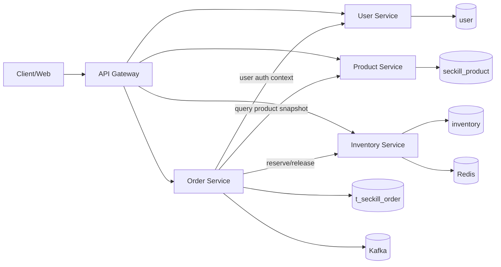
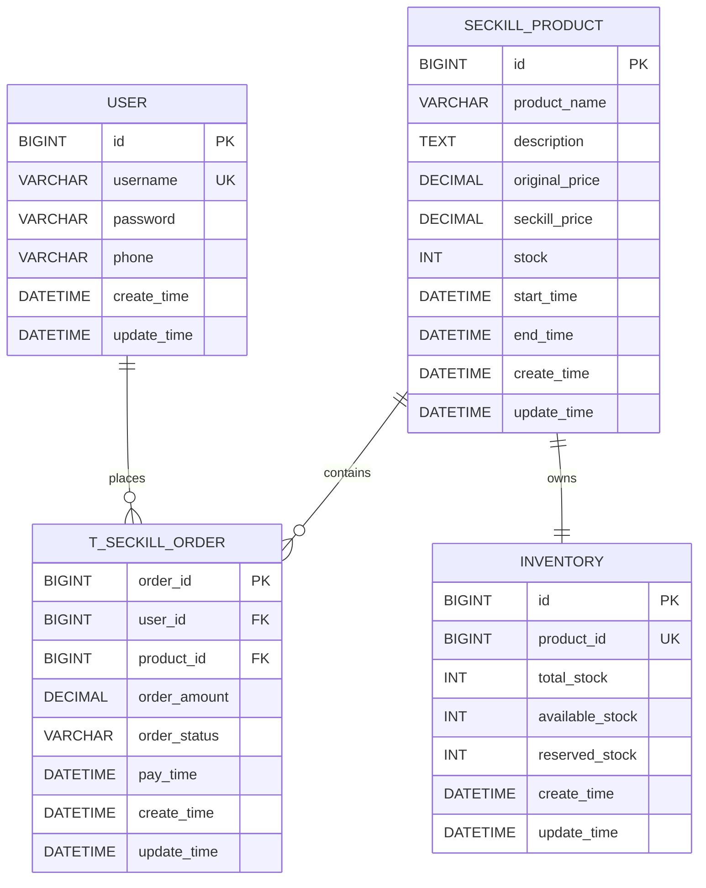

# 秒杀系统（seckill-system）

## 项目简介
基于 `Spring Boot 3.1` 的秒杀示例项目，覆盖登录注册、商品查询、秒杀下单、订单查询、缓存与可选搜索能力。

## 主要能力
- 用户注册/登录：`/api/users/*`
- 商品与秒杀：`/api/products/*`
- 订单查询与支付：`/api/orders/*`
- 启动健康检查：`/api/health/init-status`
- 可选搜索：`/api/search/*`（Elasticsearch）

## 系统架构草图（服务拆分）

> 当前仓库是单体实现；以下是按业务域拆分后的目标微服务视图，用于后续演进设计。



### 服务职责说明
- `User Service`：用户注册、登录、鉴权会话。
- `Product Service`：商品信息、秒杀活动时间窗口、商品详情查询。
- `Order Service`：下单、订单状态流转、支付确认、订单查询。
- `Inventory Service`：库存预占、扣减、回补、可售库存查询。

## 服务 API 接口定义（RESTful）

统一响应结构（示例）：

```json
{
  "code": 200,
  "msg": "success",
  "data": {}
}
```

### 1) 用户服务（User Service）

| 接口 | Method | 路径 | 说明 |
|---|---|---|---|
| 用户注册 | POST | `/api/users/register` | 注册新用户 |
| 用户登录 | POST | `/api/users/login` | 登录并获取登录态 |

请求示例：

```http
POST /api/users/register
Content-Type: application/json

{
  "username": "alice",
  "password": "123456",
  "phone": "13800000000"
}
```

```http
POST /api/users/login
Content-Type: application/json

{
  "username": "alice",
  "password": "123456"
}
```

### 2) 商品服务（Product Service）

| 接口 | Method | 路径 | 说明 |
|---|---|---|---|
| 商品列表 | GET | `/api/products/list` | 查询可参与秒杀商品 |
| 商品详情 | GET | `/api/products/{id}` | 查询指定商品详情 |
| 发起秒杀 | POST | `/api/products/seckill/{id}?userId={userId}` | 发起抢购请求（当前实现） |

请求示例：

```http
GET /api/products/1
```

```http
POST /api/products/seckill/1?userId=1001
```

### 3) 订单服务（Order Service）

| 接口 | Method | 路径 | 说明 |
|---|---|---|---|
| 查询订单状态 | GET | `/api/orders/{orderId}` | 需请求头 `X-Login-Token` |
| 查询用户订单 | GET | `/api/orders/user` | 需请求头 `X-Login-Token` |
| 订单支付 | POST | `/api/orders/{orderId}/pay` | 需请求头 `X-Login-Token` |

请求示例：

```http
GET /api/orders/202604080001
X-Login-Token: login_success_1001
```

```http
POST /api/orders/202604080001/pay
X-Login-Token: login_success_1001
```

### 4) 库存服务（Inventory Service）

> 说明：当前实现的库存字段在 `seckill_product.stock`。以下接口是拆分为独立库存服务后的建议 RESTful API。

| 接口 | Method | 路径 | 说明 |
|---|---|---|---|
| 查询库存 | GET | `/api/inventories/{productId}` | 查询商品可售库存 |
| 预占库存 | POST | `/api/inventories/reservations` | 下单前预占，支持幂等键 |
| 确认扣减 | POST | `/api/inventories/deductions` | 支付成功后确认扣减 |
| 释放库存 | POST | `/api/inventories/releases` | 超时取消或支付失败回补 |

建议请求体（预占库存）：

```json
{
  "orderId": 202604080001,
  "productId": 1,
  "userId": 1001,
  "quantity": 1,
  "idempotencyKey": "reserve-202604080001"
}
```

## 数据库 ER 图（用户/商品/库存/订单）

> 当前库中已存在：`user`、`seckill_product`、`t_seckill_order`；`inventory` 为服务拆分后的推荐独立表。



## 技术栈选型说明

### 编程语言
- `Java 17`：LTS 版本，生态成熟，适合高并发后端服务。

### 框架
- `Spring Boot 3.1.x`：快速构建微服务，配套完善。
- `MyBatis-Plus`：降低 CRUD 开发成本，便于维护 SQL 语义。
- `dynamic-datasource`：支持读写分离和多数据源动态切换。

### 中间件
- `MySQL 8`：核心业务数据存储（用户/商品/订单）。
- `Redis 6+`：热点缓存、库存预扣、限流与幂等辅助。
- `Kafka`：订单支付等异步事件解耦。
- `Elasticsearch 7.x+`（可选）：商品搜索与聚合查询。

## 快速启动

### 1) 准备环境
- JDK 17+
- Maven 3.6+
- MySQL 8+
- Redis 6+
- Elasticsearch 7.x+（可选）

### 2) 创建数据库
```sql
CREATE DATABASE IF NOT EXISTS seckill_db DEFAULT CHARSET utf8mb4;
```

应用启动时会自动初始化表和基础商品数据。

### 3) 本地运行
```bash
mvn clean package -DskipTests
java -jar target/seckill-system-0.0.1-SNAPSHOT.jar
```

默认访问地址：`http://localhost:8083`

### 4) Docker Compose（可选）
```bash
docker-compose up -d
```

`docker-compose.yml` 提供 MySQL 主从、Redis、Elasticsearch 和应用容器示例。


## 测试
```bash
mvn test -Dtest=CacheServiceTest
mvn test -Dtest=ReadWriteSeparationTest
mvn test -Dtest=SearchServiceTest
```

## 前端页面
静态页面位于 `src/main/resources/static`：
- `/index.html`
- `/main.html`
- `/products.html`
- `/orders.html`
