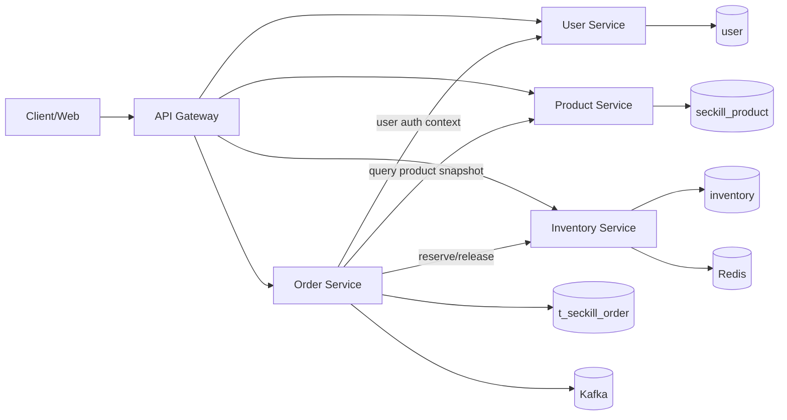
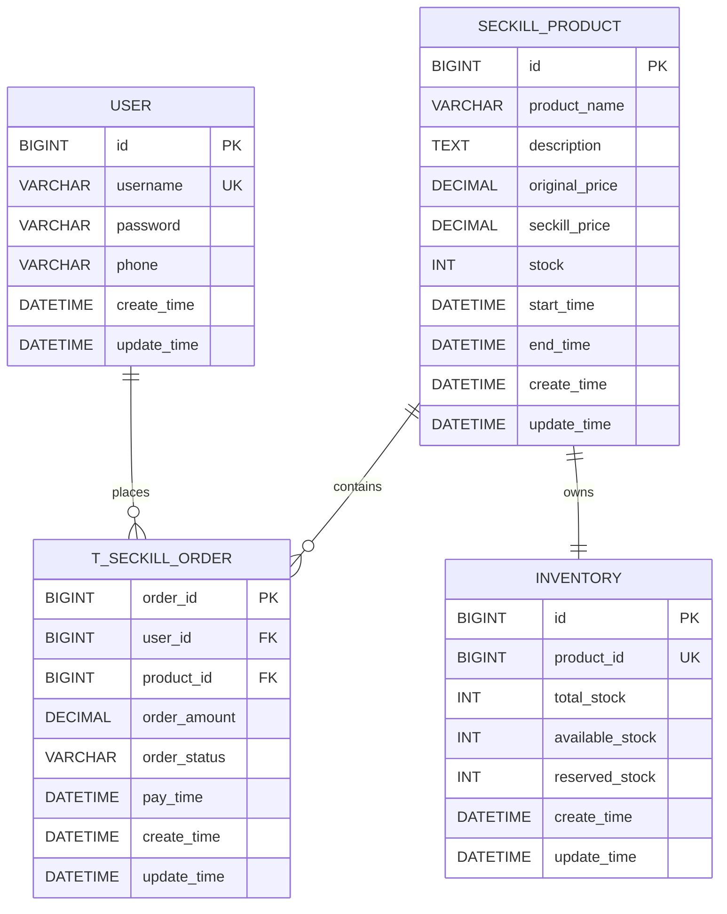

# 秒杀系统（seckill-system）

## 项目简介
基于 `Spring Boot 3.1` 的秒杀示例项目，覆盖登录注册、商品查询、秒杀下单、订单查询、缓存与可选搜索能力。

## 主要能力
- 用户注册/登录：`/api/users/*`
- 商品与秒杀：`/api/products/*`
- 订单查询与支付：`/api/orders/*`
- 启动健康检查：`/api/health/init-status`
- 可选搜索：`/api/search/*`（Elasticsearch）

## 系统架构草图（服务拆分）

> 当前仓库是单体实现；以下是按业务域拆分后的目标微服务视图，用于后续演进设计。



### 服务职责说明
- `User Service`：用户注册、登录、鉴权会话。
- `Product Service`：商品信息、秒杀活动时间窗口、商品详情查询。
- `Order Service`：下单、订单状态流转、支付确认、订单查询。
- `Inventory Service`：库存预占、扣减、回补、可售库存查询。

## 服务 API 接口定义（RESTful）

统一响应结构（示例）：

```json
{
  "code": 200,
  "msg": "success",
  "data": {}
}
```

### 1) 用户服务（User Service）

| 接口 | Method | 路径 | 说明 |
|---|---|---|---|
| 用户注册 | POST | `/api/users/register` | 注册新用户 |
| 用户登录 | POST | `/api/users/login` | 登录并获取登录态 |

请求示例：

```http
POST /api/users/register
Content-Type: application/json

{
  "username": "alice",
  "password": "123456",
  "phone": "13800000000"
}
```

```http
POST /api/users/login
Content-Type: application/json

{
  "username": "alice",
  "password": "123456"
}
```

### 2) 商品服务（Product Service）

| 接口 | Method | 路径 | 说明 |
|---|---|---|---|
| 商品列表 | GET | `/api/products/list` | 查询可参与秒杀商品 |
| 商品详情 | GET | `/api/products/{id}` | 查询指定商品详情 |
| 发起秒杀 | POST | `/api/products/seckill/{id}?userId={userId}` | 发起抢购请求（当前实现） |

请求示例：

```http
GET /api/products/1
```

```http
POST /api/products/seckill/1?userId=1001
```

### 3) 订单服务（Order Service）

| 接口 | Method | 路径 | 说明 |
|---|---|---|---|
| 查询订单状态 | GET | `/api/orders/{orderId}` | 需请求头 `X-Login-Token` |
| 查询用户订单 | GET | `/api/orders/user` | 需请求头 `X-Login-Token` |
| 订单支付 | POST | `/api/orders/{orderId}/pay` | 需请求头 `X-Login-Token` |

请求示例：

```http
GET /api/orders/202604080001
X-Login-Token: login_success_1001
```

```http
POST /api/orders/202604080001/pay
X-Login-Token: login_success_1001
```

### 4) 库存服务（Inventory Service）

> 说明：当前实现的库存字段在 `seckill_product.stock`。以下接口是拆分为独立库存服务后的建议 RESTful API。

| 接口 | Method | 路径 | 说明 |
|---|---|---|---|
| 查询库存 | GET | `/api/inventories/{productId}` | 查询商品可售库存 |
| 预占库存 | POST | `/api/inventories/reservations` | 下单前预占，支持幂等键 |
| 确认扣减 | POST | `/api/inventories/deductions` | 支付成功后确认扣减 |
| 释放库存 | POST | `/api/inventories/releases` | 超时取消或支付失败回补 |

建议请求体（预占库存）：

```json
{
  "orderId": 202604080001,
  "productId": 1,
  "userId": 1001,
  "quantity": 1,
  "idempotencyKey": "reserve-202604080001"
}
```

## 数据库 ER 图（用户/商品/库存/订单）

> 当前库中已存在：`user`、`seckill_product`、`t_seckill_order`；`inventory` 为服务拆分后的推荐独立表。



## 技术栈选型说明

### 编程语言
- `Java 17`：LTS 版本，生态成熟，适合高并发后端服务。

### 框架
- `Spring Boot 3.1.x`：快速构建微服务，配套完善。
- `MyBatis-Plus`：降低 CRUD 开发成本，便于维护 SQL 语义。
- `dynamic-datasource`：支持读写分离和多数据源动态切换。

### 中间件
- `MySQL 8`：核心业务数据存储（用户/商品/订单）。
- `Redis 6+`：热点缓存、库存预扣、限流与幂等辅助。
- `Kafka`：订单支付等异步事件解耦。
- `Elasticsearch 7.x+`（可选）：商品搜索与聚合查询。

## 快速启动

### 1) 准备环境
- JDK 17+
- Maven 3.6+
- MySQL 8+
- Redis 6+
- Elasticsearch 7.x+（可选）

### 2) 创建数据库
```sql
CREATE DATABASE IF NOT EXISTS seckill_db DEFAULT CHARSET utf8mb4;
```

应用启动时会自动初始化表和基础商品数据。

### 3) 本地运行
```bash
mvn clean package -DskipTests
java -jar target/seckill-system-0.0.1-SNAPSHOT.jar
```

默认访问地址：`http://localhost:8083`

### 4) Docker Compose（可选）
```bash
docker-compose up -d
```

`docker-compose.yml` 提供 MySQL 主从、Redis、Elasticsearch 和应用容器示例。


## 测试
```bash
mvn test -Dtest=CacheServiceTest
mvn test -Dtest=ReadWriteSeparationTest
mvn test -Dtest=SearchServiceTest
```

## JMeter 压测

### JMeter 压测文档（静态文件 + 后端服务）

#### 1. 目标
- 分别压测静态资源和后端接口。
- 观察并记录响应时间（平均值、P95、P99、最大值）以及错误率。

#### 2. 压测脚本
- 静态资源脚本：`perf/jmeter/seckill-static.jmx`
- 后端服务脚本：`perf/jmeter/seckill-backend.jmx`

#### 3. 测试环境
- 项目端口：`8083`（见 `src/main/resources/application.yml`）
- Docker 场景端口：`8084 -> 8083`（见 `docker-compose.yml`）
- JMeter：建议 `5.6.3+`

> 说明：本次仓库内已准备好脚本和执行命令模板。若本机未安装 JMeter 或服务未启动，请先完成环境准备后再执行并回填第 7 节结果。

#### 4. 场景设计

##### 4.1 静态文件压测
请求对象：
- `GET /index.html`
- `GET /main.html`
- `GET /products.html`
- `GET /orders.html`
- `GET /js/app-shell.js`

默认参数：
- 线程数：`50`
- Ramp-Up：`30s`
- 持续时间：`180s`

断言：
- `index.html` 响应包含 `<!DOCTYPE html>`。

##### 4.2 后端服务压测
请求对象：
- 读接口线程组
  - `GET /api/health/init-status`
  - `GET /api/products/list`
  - `GET /api/products/{id}`
- 写接口线程组
  - `POST /api/products/seckill/{id}?userId={userId}`

默认参数：
- 读线程数：`80`
- 写线程数：`30`
- Ramp-Up：`30s`
- 持续时间：`300s`
- `productId=1`
- `userId=1001`

断言：
- 读接口 JSONPath 断言：`$.code == 200`
- 秒杀接口响应包含 `"code"` 字段

#### 5. 执行方式（PowerShell）

##### 5.1 静态文件压测
```powershell
New-Item -ItemType Directory -Force -Path .\perf\results\static | Out-Null
jmeter -n -t .\perf\jmeter\seckill-static.jmx -l .\perf\results\static\result.jtl -e -o .\perf\results\static\html -Jhost=127.0.0.1 -Jport=8083 -Jthreads=50 -JrampUp=30 -Jduration=180
```

##### 5.2 后端接口压测
```powershell
New-Item -ItemType Directory -Force -Path .\perf\results\backend | Out-Null
jmeter -n -t .\perf\jmeter\seckill-backend.jmx -l .\perf\results\backend\result.jtl -e -o .\perf\results\backend\html -Jhost=127.0.0.1 -Jport=8083 -JreadThreads=80 -JwriteThreads=30 -JrampUp=30 -Jduration=300 -JproductId=1 -JuserId=1001
```

##### 5.3 Docker 端口场景
如应用通过 `docker-compose` 运行，请改用 `-Jport=8084`。

#### 6. 指标解读口径
优先关注：
- 平均响应时间（Average）
- P95 / P99 响应时间
- 吞吐量（Throughput）
- 错误率（Error %）

建议阈值（可按业务调整）：
- 静态资源：P95 < `200ms`，错误率 < `0.1%`
- 后端读接口：P95 < `300ms`，错误率 < `1%`
- 后端写接口：P95 < `500ms`，错误率 < `2%`

#### 7. 响应时间观察记录（执行后回填）

##### 7.1 静态文件
| 指标 | 数值 |
|---|---|
| Samples | 527632 |
| Error % | 39.99% |
| Average (ms) | 15.57 |
| P95 (ms) | 35 |
| P99 (ms) | 55 |
| Max (ms) | 248 |

##### 7.2 后端服务
| 指标 | 数值 |
|---|---|
| Samples | 2738494 |
| Error % | 0.00% |
| Average (ms) | 28.60 |
| P95 (ms) | 110 |
| P99 (ms) | 181 |
| Max (ms) | 1419 |

##### 7.3 后端处理请求数均衡验证（读库）
统计口径：对 `seckill-mysql-slave1` 与 `seckill-mysql-slave2` 的 `Com_select` 计数做压测前后差分。

- 压测前：slave1=`310454`，slave2=`312089`
- 压测后：slave1=`400874`，slave2=`402879`
- 增量：slave1=`90420`，slave2=`90790`
- 偏差：`|90790-90420| / ((90790+90420)/2) = 0.41%`

结论：两台读后端处理请求数差异约 `0.41%`，可认为大致相等。

##### 7.4 结论
- 静态文件场景：响应时间表现良好（P95=35ms，低于 200ms），但错误率 39.99%，明显高于阈值 0.1%，整体不达标。
- 后端服务场景：P95=110ms、错误率 0.00%，均在阈值范围内，整体达标。
- 后端读请求分布：slave1/slave2 增量差异约 0.41%，负载分配基本均衡。
- 建议优先排查静态场景的失败样本（响应断言、路径命中、返回码分布），确认高错误率是否来自断言策略而非真实服务故障。

#### 8. 常见问题
- `Connection refused`：服务未启动或端口不对。
- `JSONPathAssertion failed`：接口返回非预期 JSON，先检查业务初始化状态。
- 错误率高且响应时间抖动：先排查 MySQL/Redis 连接与容器资源限制。

## 前端页面
静态页面位于 `src/main/resources/static`：
- `/index.html`
- `/main.html`
- `/products.html`
- `/orders.html`
